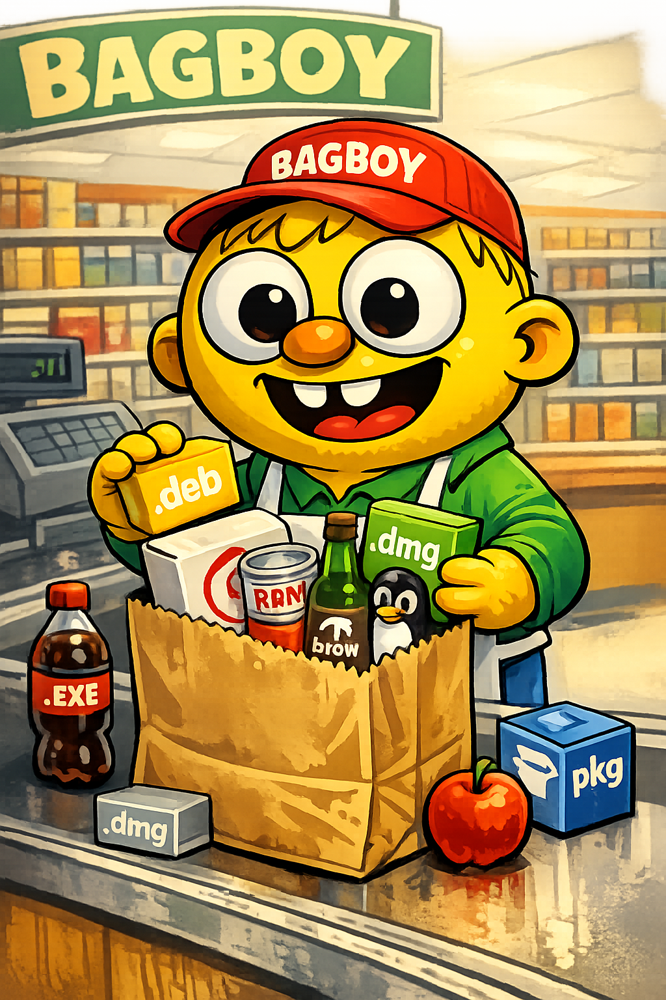

# bagboy - Universal Software Packager

<div align="center">
  
</div>

Pack once. Ship everywhere. 

bagboy is a simple, fast, and comprehensive software packaging tool that generates packages for all major platforms from a single configuration file.

<div align="center">
  
</div>

## 🚀 Quick Start

```bash
# Initialize your project
bagboy init

# Create all packages
bagboy pack --all

# Publish everything (packages + GitHub release)
bagboy publish
```

## ✨ Features

- **Universal**: Supports 20 package formats including Homebrew, Scoop, DEB, RPM, AppImage, MSI, Chocolatey, Winget, Docker, Apptainer, Spack
- **Simple**: One YAML config file, minimal setup
- **Fast**: Written in Go, parallel packaging
- **GitHub Integration**: Automatic releases, tap/bucket management, Winget PRs
- **Smart Installer**: Generates curl|bash scripts with OS detection
- **Code Signing**: Built-in support for macOS, Windows, Linux, Sigstore, SignPath.io, and Git signing
- **Cross-platform**: Build all packages from any OS

## 📦 Supported Package Formats

| Format | Platform | Status |
|--------|----------|--------|
| **Homebrew** | macOS | ✅ |
| **Scoop** | Windows | ✅ |
| **DEB** | Debian/Ubuntu | ✅ |
| **RPM** | RedHat/CentOS | 🚧 |
| **AppImage** | Linux | 🚧 |
| **MSI** | Windows | 🚧 |
| **DMG** | macOS | 🚧 |
| **Chocolatey** | Windows | 🚧 |
| **Winget** | Windows | 🚧 |
| **curl\|bash** | Unix | ✅ |

## 🛠 Installation

```bash
# Via curl (once released)
curl -fsSL bagboy.sh/install | bash

# Or build from source
git clone https://github.com/scttfrdmn/bagboy
cd bagboy
make build
sudo cp bin/bagboy /usr/local/bin/
```

## ⚙️ Configuration

Create `bagboy.yaml` in your project root:

```yaml
name: myapp
version: 1.0.0
description: My awesome application
homepage: https://myapp.com
license: MIT
author: Your Name <you@example.com>

# Binary locations (after building)
binaries:
  darwin-amd64: dist/myapp-darwin-amd64
  darwin-arm64: dist/myapp-darwin-arm64
  linux-amd64: dist/myapp-linux-amd64
  windows-amd64: dist/myapp-windows-amd64.exe

# GitHub integration
github:
  owner: yourname
  repo: myapp
  token_env: GITHUB_TOKEN
  
  release:
    enabled: true
    generate_notes: true
  
  # Homebrew tap
  tap:
    enabled: true
    repo: yourname/homebrew-tap
    auto_create: true
    auto_commit: true
    auto_push: true
    
  # Scoop bucket  
  bucket:
    enabled: true
    repo: yourname/scoop-bucket
    auto_create: true
    auto_commit: true
    auto_push: true

# Installer script
installer:
  base_url: https://github.com/yourname/myapp/releases/download/v{{.Version}}
  install_path: /usr/local/bin
  detect_os: true
  verify_checksum: true

# Package-specific options
packages:
  brew:
    test: |
      system "#{bin}/myapp --version"
  
  deb:
    maintainer: you@example.com
    section: utils
    priority: optional

# Code signing configuration
signing:
  macos:
    identity: "Developer ID Application: Your Name"
    notarize: true
    apple_id: ""      # Set via APPLE_ID env var
    team_id: ""       # Set via APPLE_TEAM_ID env var
    app_password: ""  # Set via APPLE_APP_PASSWORD env var
  windows:
    certificate_thumbprint: ""  # Set via WINDOWS_CERT_THUMBPRINT env var
    timestamp_url: "http://timestamp.digicert.com"
  linux:
    gpg_key_id: ""    # Set via GPG_KEY_ID env var
    
  # Modern signing solutions
  sigstore:
    enabled: false
    keyless: true
    oidc_issuer: "https://token.actions.githubusercontent.com"
  signpath:
    enabled: false
    organization_id: ""  # SignPath dashboard
    project_slug: ""     # SignPath project
    api_token: ""        # SIGNPATH_API_TOKEN env var
  git:
    enabled: false
    gpg_key_id: ""       # GPG_KEY_ID env var
    sign_tags: true
    sign_commits: false
```

## 🎯 Commands

```bash
# Initialize new project
bagboy init                    # Auto-detect project info
bagboy init --interactive      # Interactive setup

# Create packages
bagboy pack --all              # All supported formats
bagboy pack --brew --scoop     # Specific formats
bagboy pack --deb --installer  # Multiple formats

# Code signing
bagboy sign --check            # Check signing setup
bagboy sign --binary app       # Sign specific binary

# Validate configuration
bagboy validate

# Full publish workflow
bagboy publish                 # Pack + GitHub release + distribution
bagboy publish --dry-run       # Preview what would happen
```

## 🔄 Typical Workflow

1. **Build your binaries** for all target platforms
2. **Initialize bagboy**: `bagboy init`
3. **Review config**: Edit `bagboy.yaml` as needed
4. **Test locally**: `bagboy pack --installer` 
5. **Publish**: `bagboy publish`

This will:
- ✅ Create all package formats
- ✅ Create GitHub release with assets
- ✅ Update Homebrew tap
- ✅ Update Scoop bucket
- ✅ Submit Winget PR (if configured)

## 🌐 Installation Methods Generated

After publishing, users can install your app via:

```bash
# Homebrew (macOS)
brew install yourname/tap/myapp

# Scoop (Windows)
scoop bucket add yourname https://github.com/yourname/scoop-bucket
scoop install myapp

# curl|bash (Unix)
curl -fsSL https://github.com/yourname/myapp/releases/download/v1.0.0/install.sh | bash

# DEB (Debian/Ubuntu)
wget https://github.com/yourname/myapp/releases/download/v1.0.0/myapp_1.0.0_amd64.deb
sudo dpkg -i myapp_1.0.0_amd64.deb

# Winget (Windows, after PR approval)
winget install YourName.MyApp
```

## 🏗 Project Structure

```
bagboy/
├── cmd/bagboy/           # CLI application
├── pkg/
│   ├── config/          # Configuration handling
│   ├── packager/        # Package format implementations
│   │   ├── brew/        # Homebrew formulas
│   │   ├── scoop/       # Scoop manifests
│   │   ├── deb/         # Debian packages
│   │   └── installer/   # curl|bash scripts
│   ├── github/          # GitHub API integration
│   └── init/            # Project detection
├── examples/            # Example configurations
└── Makefile            # Build automation
```

## 🤝 Contributing

1. Fork the repository
2. Create a feature branch
3. Add tests for new packagers
4. Submit a pull request

## 📄 License

MIT License - see [LICENSE](LICENSE) for details.

## 🎯 Roadmap

### ✅ **Completed Milestones**

#### **v0.1.0 - Foundation** 
- [x] Core CLI and configuration system
- [x] Extensible packager registry pattern
- [x] 18+ package format support structure

#### **v0.2.0 - Core Package Formats**
- [x] Homebrew formula generation
- [x] Scoop manifest generation  
- [x] DEB package creation
- [x] RPM package creation
- [x] AppImage building
- [x] MSI package creation
- [x] Chocolatey packages
- [x] Winget manifest generation

#### **v0.3.0 - GitHub Integration**
- [x] GitHub release automation
- [x] Homebrew tap management
- [x] Scoop bucket management
- [x] Winget PR automation

#### **v0.4.0 - Code Signing** ✅ **Completed**
- [x] Multi-platform code signing (macOS, Windows, Linux)
- [x] Sigstore/Cosign keyless signing
- [x] SignPath.io cloud signing
- [x] Git tag signing integration

### 🚧 **Upcoming Milestones**

#### **v0.5.0 - Complete Package Formats** ✅ **Completed**
- [x] DMG packager for macOS
- [x] Snap packager for Linux
- [x] Flatpak packager for Linux  
- [x] MSIX packager for Windows

#### **v0.6.0 - Quality & Performance** ✨ **Current** (Target: April 2026)
- [ ] Increase test coverage to 60%+
- [ ] Performance benchmarks and optimization
- [ ] Comprehensive documentation
- [ ] Enhanced CLI user experience

#### **v0.7.0 - Advanced Features** (Target: May 2026)
- [ ] Checksum generation and verification
- [ ] Package validation functionality
- [ ] Deployment automation and CI/CD integration
- [ ] Configuration templates and presets

#### **v1.0.0 - Production Ready** (Target: July 2026)
- [ ] Final polish and production hardening
- [ ] Comprehensive testing and validation
- [ ] Performance optimization
- [ ] Enterprise-grade reliability

## 📚 Documentation

- **[Complete Documentation](docs/README.md)** - Comprehensive guide with examples
- **[API Reference](docs/API.md)** - Detailed API documentation
- **[Package Formats Guide](docs/PACKAGE_FORMATS.md)** - All 20+ supported formats
- **[Code Signing Guide](docs/CODE_SIGNING.md)** - Multi-platform signing setup
- **[Examples & Tutorials](docs/EXAMPLES.md)** - Real-world usage examples
- **[Troubleshooting Guide](docs/TROUBLESHOOTING.md)** - Common issues and solutions

---

**bagboy** - Because shipping software shouldn't be harder than building it. 📦
